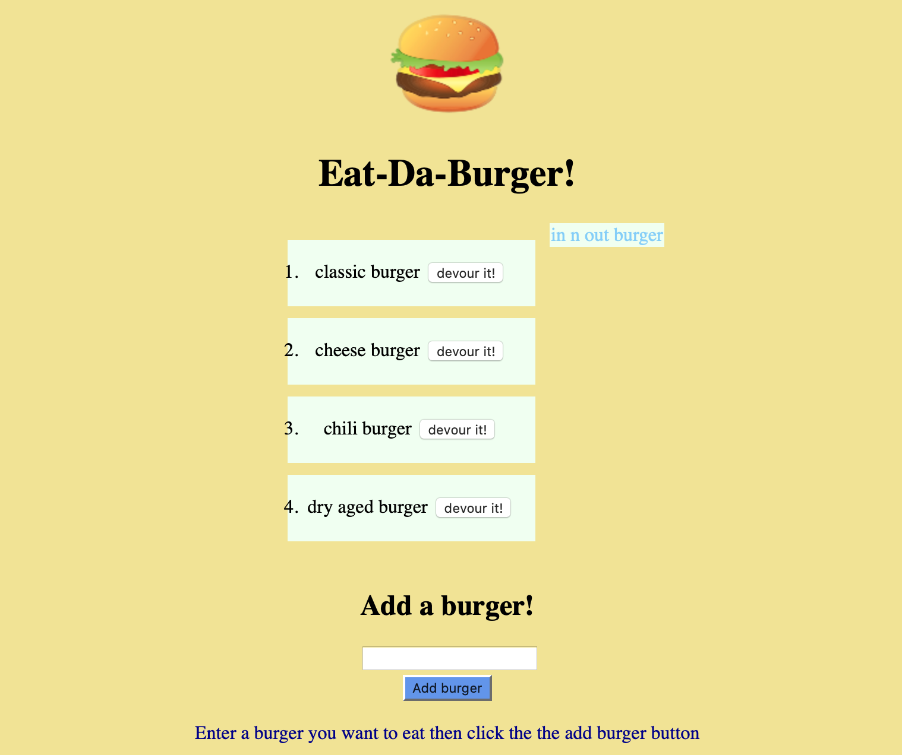

# Burger

## Description 

This application is designed to log and virtually eat burgers! This app is simple; however, this application's process helped me get familiar with databases, express, handlebars, and create my own ORM. The application enables the user to log a burger and click on the devour button to log it as eaten! 

## Table of Contents
* [Installation](#installation)
* [Usage](#usage)
* [Credits](#credits)
* [License](#license)
   
## Installation

The installation of this project is to access my github repository and then click on note-taker or click this link [Burger](https://github.com/hondahelix/burger) then click on the green code button in the top right corner. Then you can copy and paste the code via ssh or by downloading a zip file. Once you have downloaded the file there are a couple of things that must be downloaded in order for this application to run properly. The first is node.js once this is downloaded open up the terminal and navigate to the file that this project is saved in. Then run the code:
npm i 
This should download express, express-handlebars and mysql. After that copy the seed.sql and schema.sql file into mysql and run the code. This will create a database. Furthermore, the password will need to be changed to match the password for your mysql. Then all that is left to do is run the command:
node server.js 
then go to the browser and type in localhost: and the port it connects to. or see the deployed heroku link [heroku link](https://evening-plains-49855.herokuapp.com)

## Usage 
The usage is to log and virtually eat burgers! This link will bring you to the deployed site in Heroku.
[heroku link](https://evening-plains-49855.herokuapp.com)

                    website on heroku

   
## Credits

Third party applications and instruction was provided by the University of California Berkeley' full stack Coding Bootcamp program as well as the utilization of node.js, express, handlebars, mysql and heroku.  

[UCB Coding Bootcamp](https://bootcamp.berkeley.edu/coding/)   

[Node.js](https://https://nodejs.org/en/)   

[express](https://expressjs.com/) 

[Handlebars](https://handlebarsjs.com/)

[mysql](https://www.mysql.com/)  

[heroku](https://www.heroku.com/free)   

## License

 MIT

## Badges

## Contact

[My Github](https://github.com/hondahelix) 

[My portfolio](https://hondahelix.github.io/responsive_portfolio/)
